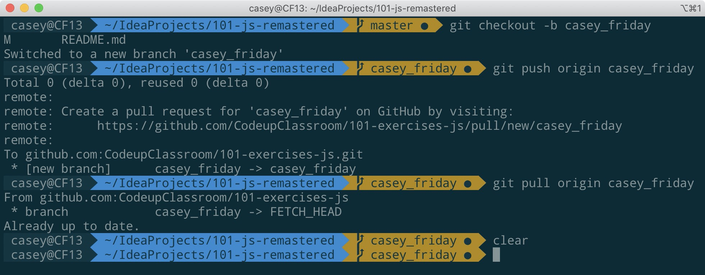

# 101 Exercises for JS

## Instructions for Students
In order to submit your 101-JS exercises, you'll need to follow these guidelines:
1. Clone this repository to your laptop.
2. Create a branch, and name it using this format: firstname_lastname (*i.e. casey_friday*)

**This screenshot shows how to create and push your branch, once you have cloned the project, and changed into the project's root directory.**

*Remember to change 'firstname_lastname' to your name, the same as your branch name.*

Ensure you **always** push to **your** branch, when committing your 101-JS changes, like so:

`username@macbook ~IdeaProjects/your-101-folder: `**`git push origin firstname_lastname`**

You can always run the command ```git branch -a``` to list all existing branches (and verify that your branch is the active branch), and hit the **q** key to quit out of 

## Rationale
- 101 Exercises exists as a self-test tool for learning JS fundamentals including data types, operators, and writing user defined fuctions. There are also exercises for practicing with collections such as arrays, objects, and arrays of objects. 
- The best way to learn how to program is write programs. Each exercise is a tiny little prog    ram.
- Expect to do a tremendous amount of search engine searches, make many mistakes, and try again. This is all part of programming. Take breaks.

## Orientation
- `index.html` is the page that runs all the JS contained in `101-exercises.js`
- Open the JavaScript console in Firefox or Chrome. F12 usually works.
- Start writing solutions inside of 101-exercises.js in the editor.
- Refresh `index.html` to re-run any new changes from 101-exercises.js

## Resources
- <a href="https://developer.mozilla.org/en-US/docs/Learn/JavaScript/First_steps" target="_blank">JS First Steps</a>
- <a href="https://developer.mozilla.org/en-US/docs/Learn/JavaScript/Building_blocks" target="_blank">JS Building Blocks</a>
- <a href="https://developer.mozilla.org/en-US/docs/Web/JavaScript/Reference/Functions" target="_blank">Functions reference</a>
- <a href="https://eloquentjavascript.net/" target="_blank">First chapters of Eloquent JavaScript</a>

## Troubleshooting
### General Guidance
- JS Code runs from top to bottom
- Any error in your JS code keeps the following code from running.
- Double check your spelling. Capitalization matters in programming.
- If you're sure you spelled something, check it anyways.
    
### Error messages
_Reference Error_ means you need to define the variable or function. 

The number by the 101-exercises.js filename highlights the line where the variable is referenced before it exist


_Syntax Error_ means there's a syntax error that needs to be fixed. 
The number by the 101-exercises.js filename highlights the line where the syntax error exists.


 
_Uncaught Error_ means the answer is incorrect and doesn't match the test. 
The number by the 101-exercises.js filename highlights the line for the exercise where the expected value in the test does not match the actual value provided by the attempted solution. Ignore the line number 6 in assert.js.
 

  
### Typos or misspellings
If you notice any typos, misspellings, or mistakes, please triple check your work and [open an issue on GitHub](https://github.com/CodeupClassroom/101-exercises-js/issues) citing both the line number and exercise number.
